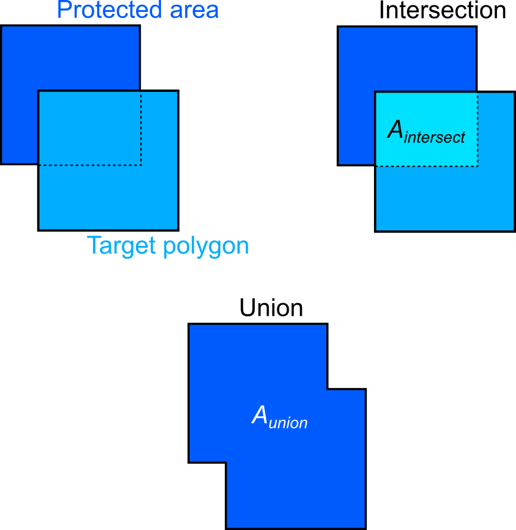

# Risk of invading protectec areas

_Written on April 3, 2024_

## Input data

### Protected areas

The latest version of the protected areas obtained from the [World Database of Protected Areas](http://www.protectedplanet.net) (WDPA). The original data is split in three ESRI shapefiles, one shapefile for each type conservation element (polygons, lines or points). Only protected areas expressed as polygons were used in this analysis.

The protected areas for each country were extracted to separate files in Geopackage format. The polygons were stored in geographic projection system (GCS) and reprojected to the Mollweide projection to preserve area for further computation.

### Target polygons

Target polygons are provided in GeoJSON format and stored in GCS. Polygons are reprojected to Mollweided projection. The attribute table of the polygons has a field called Map_ID, which is the unique identifier. By convention, the new vector file should be named after the original file, adding the `_Mollweide` section before the file extension. For example:

Original filename: `eth_maize1.geojson`

Output filename: `eth_maize1_Mollweide.geojson`

## Processing

Protected areas are overlaid with the layer of target polygons. This operation generates a new vector layer. We add two new attributes to that layer: the value of the _intersection over union_ (IoU; see next paragraph) and the _risk category_. Based on the IoU metric, a risk level is assigned to each feature. If the user uses a _simple_ approach, the '_potential risk_' level is assigned if IoU > 0, or '_No risk_' otherwise. Alternatively, a risk level is assigned based on the quantiles estimated across all the IoU values:

|Quantile|Category|
|:---:|----------|
|1st|No significant stress |
| 2nd | Moderate stress |
| 3rd | Severe stress |
| 4th | Extreme stress|

When a feature of the target polygons does not intersect any protected area, the IOU field is automatically assigned a value of 0, and a category of "No risk". For each feature of the target polygon layer that did intersect the PA layer, we estimate their IoU&mdash;the proportion of common area between the target polygon and the protected area(s) it overlaps to the union of both areas, as shown in the figure below.

The level of stress on biodiveristy is estimated as:

$$
Biodiversity\ risk = \frac{A_{intersect}}{A_{union}}
$$

Once the PA and target polygon layers have been prepared, the script `estimate_biodiversity_stress_country.py` must be launched. This a command line tool that expects three parameters:

- full path to the (preprocessed) target polygon layer
- full path to the (preprocessed) PA layer
- key field
- the rule to assign the risk level
- the output directory where the results will be stored.

By convention, the output file is named after the original file, adding the `_biodiversity_Mollweide` suffix before the file extension. For example:

Original filename: `eth_maize1.geojson`

Output filename: `eth_maize1_biodiversity_Mollweide.geojson` 

By default, the output file is reprojected back to the GCS.

TODO:
- Include a command-line interface
- Fix behavior of progress bar.
- Functionality to process a series of target polygon layers in batch.

## Summary

The processing flow is as follows:

1. Extract protected areas for the country of interest.
    - Select protected ares for that country.
    - Export selected features to a new GeoJSON file. Features are normally in the GCS.
    - Project the new file to the Mollweide projection.

2. Reproject the target polygons from the GCS to Mollweide projection.

3. Run the script `estimate_biodiversity_stress_country.py`.

4. Project the output files back to the GCS.