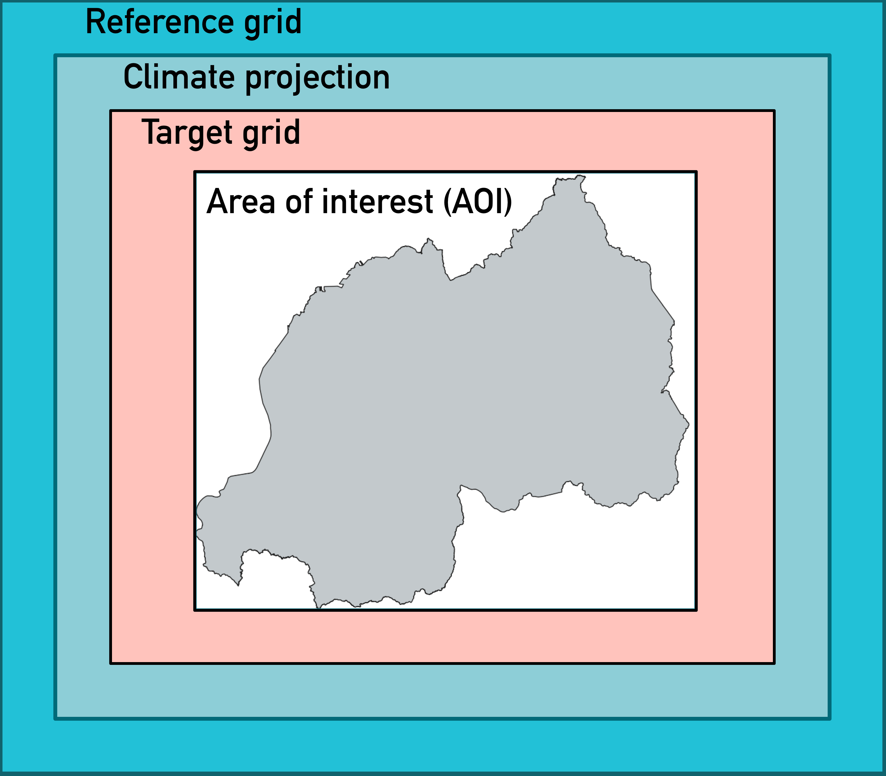

# Estimating NDWL0 using climate projections of HighResMIP

This process requires the package common data operators (CDO) and the netCDF operators (NCO). Scripts provided here were run in the Cygwin environment, but both packages are also available through Anaconda.

These are the steps in the process:

1. Build folder structure for the data
2. Download source data
3. Data preprocessing climate projections data
4. Define area of interest
5. Bias correction of climate projections data


## 1. Build folder structure for the data
***

It's recommended to run this process in a dedicated directory (folder), with subdirectories for tools and scripts, input and output data. In diagram below, to estimate NDWL0 for Ethiopia&mdash;the area of interest&mdash;, for example, we would suggest the structure below:

Diagram 1. Structure of the directory where NDWL0 will computed.
<a id="directory-structure"></a>
```
ETHIOPIA
├──── BIAS_CORRECTION
├──── ROI
├──── CLIMATE
├──── SOILS
└──── SCRIPTS
```

The directories above will contain the following data:

- ETHIOPIA: this directory is named after the code/name assigned to the area on interested (see following sections).
- BIAS_CORRECTION: contains the bias-corrected data.
- CLIMATE: it contains the the climate for precipitation (pr), downward solar radiation (rds), minimum (tasmin) and maximum temperature, each in subdirectory. This subdirectories will be automtically created along the process.
- SOILS: soils data for the mask of the area of interest. These data are taken from the Africa soils database.
- SCRIPTS: contains the scripts and tools described here. **Note: given that some scripts use relative paths, we strongly recommend to run make this directory the active, or working, directory and run the scripts from here**.

## Download data
***

Estimating NDWL0 requires the following data:

- Daily precipitation rate (in mm)
- Maximum daily surface temperature (in degrees Celsius)
- Minimum daily surface temperature (in degrees Celsius)
- Solar radiation flux (in $J\,m^{2}\,day^{-1}$). It has to componentes, short- and longwave that must be added to estimate the total downward solar radiation flux.

Estimating NDWL0 for the period 2023 &ndash; 2027 required projections of the climate variables above. We used climate simulations distributed by the [Earth System Grid Federation (ESGF)](https://aims2.llnl.gov/). We used projections from the HighRESMIP experiment, which provides climate projections for the period 2015&ndash;2050. We use only the model EC-Earth-HR, realization r1i1p2f1, regular grid (gr). We also downloaded simulations for the historical climate for the period 1981&ndash;2014, required for bias correction (see following sections).

The files follow a naming convention:

`varname_timestep_modelname_experiment_realization_grid_startdate_enddate.nc`

- varname: variable code. We are interested in:
- timestep: time step of the output (e.g., day, month)
- modelname: model name
- experiment: climate projections for the period 2015&ndash;2050 are coded highres-future; simulations of the historical climate are coded 1050-hist
- realization:
- grid: it could be the native grid resolution (gn) or a regular grid (gr)
- startdate, enddate: expressed as yyyymmdd, where yyyy is the year, mm is the month (01, 02,...,12) and dd is the day (01, 02, 03, ...)

HighResMIP data comes in NetCDF format, which is why the process describe here relies on the NCO and CDO to manipulate the data. The data are organized one file per year. The diagram below shows how data are organized. A parent directory HIGHRESMIP contains one subdirectory for the original data (global) and one for each area of interest. The original data contains one subdirectory for the future data and one for the this historical simulation. Both future and historical simulations contain one subdirectory for each variable of interest.

<a id="highresmip-directories"></a>
Diagram 2. Structure of the directories where HighResMIP data is stored.
```
HIGHRESMIP
├──── ORIGINAL
│       └──FUTURE
│       │     └── pr
│       │     └── rlds
│       │     └── rsda
│       │     └── tasmax
│       │     └── tasmin
│       └──HISTORICAL
│            └── pr
│            └── rlds
│            └── rsda
│            └── tasmax
│            └── tasmin
├──── ETHIOPIA
│       └──FUTURE
│       │     └── pr
│       │     └── rlds
│       │     └── rsda
│       │     └── tasmax
│       │     └── tasmin
│       └──HISTORICAL
│            └── pr
│            └── rlds
│            └── rsda
│            └── tasmax
│            └── tasmin
├──── MOROCCO
└──── PHILIPPINES
```

Climate projections from HighResMIP require bias correction. However, for this application we did not bias correct temperature data. Bias correction process is described further ahead. Two additional datasets were used as reference:

- Daily precipitation rates from the [Rainfall Estimates from Rain Gauge and Satellite Observations](https://www.chc.ucsb.edu/data/chirps) (CHIRPS). The data comes in NetCDF format and are organized in yearly. We used the version at 0.25&deg; resolution.

- Solar radiation flux, derived from the [AgERA5](https://cds.climate.copernicus.eu/cdsapp#!/dataset/sis-agrometeorological-indicators?tab=overview) dataset, which is based on the Reanalysis of European Centre for Medium-Range Weather Forecasts ERA5 and provides hourly data of climate variables at surface level for agriculture and agro-meteorological studies. The data are stored in NetCDF format and are organized in one file per day. The data comes at 0.1&deg; resolution.

## 3. Data preprocessing climate projections data

### Data remapping

In HighResMIP data files longitude ranges from 0 to 360&deg;, so the grids require reorientation to express longitude in the range &minus;180&deg; &ndash; 180&deg;. This process must be carried out only the first time, given that HighResMIP data are global. For smaller areas we extract a data subset. The grid reorientation can be carried out, for example, using the CDO package or the NCO package as suggested in [this](https://stackoverflow.com/questions/57682977/converting-longitude-in-netcdf-from-0360-to-180180-using-nco) source.

Update (2024-06-19): The data were donwloaded with global coverage, and were mapped onto a Gaussian grid. Data were required in geographic projection, i.e., a regular latitude&ndash;longitude grid. The source data also had a high level of compression.
The original data were remapped onto a regular grid of 25 arc minutes (approximately 50 km at the Equator). The following command was used to remap precipitaton flux data:

`cdo -L -z zip10 -sellonlatbox,-180,180,-90,90 -remapcon,grid_latlon.txt inputfile.nc outputfile.nc`

In the previous command the original data is first remapped (`remapcon` operator) onto the target grid (regular grid). The target grid is defined in the file `grid_latlon.txt`. The content of that file is shown below. Because data are being remapped to a coarser resolution, a conservative mapping method is used to conserve mass. Conservative mapping was also applied to solar radiation flux to ensure energy conservation. Next, the data are rotated (`sellonlatbox` operator) so that longitudes are within the range &minus;180&deg; &ndash; 180&deg;.

For remapping temperature data:

`cdo -L -z zip10 -sellonlatbox,-180,180,-90,90 -remapbil,grid_latlon.txt inputfile.nc outputfile.nc`

Unlike precipitation, bilinear interpolation (`remapbil` operator) is used to remap temperature.

Definition of the target grid:

```
gridtype = lonlat
xsize = 864
ysize = 432
xfirst = -179.791666667
xinc = 0.416666667
yfirst = -89.791666667
yinc = 0.416666667
```

### Time series of daily minimum and maximum air temperature

These data do not require bias correction. Therefore, after remapping the data are grouped to produce a time series. Units are converted from Kelvin to degrees Celsius. After these operations the data are copied directly to the `NDWL0/CLIMATE` directory.

`cdo -L -chname,tmax,tasmax -selvar,tmax -setattribute,tmax@units="degrees Celsius"  -expr,'tmax = tasmax - 273.15' -mergetime *.nc output.nc`

### 4. Define area of interest (AOI)

Currently, we process data for entire countries. We define the AOI for each country using national boundaries from the global database of administrative boundary GADM version 4.1. Individual vector files in GEOJSON format are generated for each country. The AOI is then rasterized and stored in GeoTIFF format. For this process, we use the script `createROIMask.R`, a modified version of the R script originally written by Harold Achicanoy.

The script reads in (from command line) two parameters:

- the full path to the location of the GEOJSON file containing the vector data that will be used to define the extent of the AOI. The files should be named following the convention: `gadm41_XXXX_0.json`, where `XXXX` is the code/name for the AOI. The AOI code should not contain spaces. The script will write out the output data&mdash;a GeoTIFF file with the mask of the AOI&mdash;to a file called `gadm41_XXXX_0.tif` in the directory `ROI`.

- The template to use to define the outut grid. Templates are predefined raster from which the spatial data is extracted. The available templates are stored in the `SCRIPTS` directory (see [Diagram 1](#directory-structure)).

The AOI is currently generated at a horizontal resolution of 0.1&deg;, using the grid of AgERA data as template. The extent of the AOI equals the extent of the country in the vector file, increased by 0.1&deg; in each direction to avoid leaving parts of the country outside of the analysis, depending on the rasterization algorithm.


### Subsetting HighResMIP data

Climate projections data were clipped to a slightly larger extent than that of the AOI. This ensured that data were available when interpolating at points close to the border of the AOI.

<a id="area-of-interest">Figure 1. Area of interest and extent of the grid, climate projection and reference data.</a>


The script estimates an initial extent as one that is estimated on the grid of the HighResMIP data and completely covers the AOI. Then the extent is increased in every direction by two cells. The script `clip_HighResMIP_future.sh` and `clip_HighResMIP_historical.sh` are command-line tools that clips all the required variables from HighResMIP dataset the whole time period, for the future and historical periods, respectively. The tool reads in the following parameters:

- The coordinates of the clipping box.
- An identifier for the output data. It's basically a suffix that is added to the output file name to distinguish it from others.
- The path to the directory that contains the original files. This would be the absolute path to the directory `HIGHRESMIP` shown in [Diagram 2](#highresmip-directories).
- The path to the directory that will store the output data. This should point to the `CLIMATE` directory shown in [Figure 1](#area-of-interest).

When running the script without parameters, or specifying the option 'help', it provides details about the parameters it expects.

#### Reference data

As mentioned above, climate projections data were clipped to conver an area slightly larger than the AOI. Likewise, the reference data, used for bias correction, were clipped to an area larger than that of the climate projections, as shown in the figure above.

Two scripts, `clip_CHIRPS_nc.sh` and `clip_AgERA_srad.sh` are provided to clip CHIRPS and AgERA, respectively. Both scripts read in the same parameters than the script to clip HighResMIP data, but are tailored to process specific file names.

### Bias correction

For bias correction we used the [downscaleR](https://github.com/SantanderMetGroup/downscaleR) package. It requires time series of (a) the observed data for the reference period, (b) the simulated climate during the reference period and (c) the  data for the future period. All three datasets must be at the same spatial resolution. We produced a time series for each field (e.g., using `mergetime` operator from CDO).

The fields of short- and longwave solar radiation were added to estimate total radiation flux. Fluxes were converted from $W m^{-2}$ (or $J\,m^{-2}\,s^{-1}$) to $J\,m^{-2}\,day^{-1}$.

```
cdo -L -setattribute,rds@units="J m-2 day-2" -setattribute,rds@long_name="Surface Downwelling Longwave + Shortwave Radiation" -selvar,rds -expr,'rds = (rlds + rsds) * 86400' -merge input-shortwave.nc input-longwave.nc output.nc
```

Rrecipitation flux from HighResMIP had to be converted from $kg\,m^{-2}\,s^{-1}$ to $mm\,day^{-1}$.

```
cdo -L -setattribute,prec@units="mm day-1" -setattribute,prec@long_name="Precipitation" -selvar,prec -expr,'prec = pr * 86400' input.nc output.nc
```

We used the version of CHIRPS that comes at 0.25&deg;. AgERA comes at 0.1&deg;. We remapped CHIRPS and AgERA data to match the spatial resolution of HighResMIP data. We used the scripts resample_CHIRPS_HighResMIP.sh and resample_AgERA_HighResMIP.sh to produce a time series of each dataset.

### Clipping input data
```bash

#!/bin/bash

country="Ethiopia"
countryupp=$(echo $country | tr [:lower:] [:upper:])

# Source directory
srcdir="//CATALOGUE.CGIARAD.ORG/OneSustainableFinance/ANALYZER/CLIMATE/CHIRPS-2.0/global_daily/netcdf/p25"

# Destination directory
dstdir="//CATALOGUE.CGIARAD.ORG/OneSustainableFinance/ANALYZER/CLIMATE/CHIRPS-2.0/${countryupp}_daily"

for year in $(seq 1981 2010); do

	filename=chirps-v2.0.${year}.days_p25.nc
	
	src=${srcdir}/$filename
	
	dst=$dstdir/chirps-v2.0.${year}.days_p25_${country}.nc

	ncks --dmn latitude,2.35,15.85 --dmn longitude,31.95,49.05 $src $dst
done

```

```bash

#!/bin/bash

# Daily fluxes are stored in individual files, e.g.
# Solar-Radiation-Flux_C3S-glob-agric_AgERA5_yyyymmdd_final-v1.0
#
# the field yyyymmdd is a placeholder that specifies the date, with
# yyyy = year, e.g. 1979
# mm = month in 2-digit format, e.g. 01 for January, 10 for October
# dd = day in 2-digit format

srcdir="//192.168.20.97/Data/observed/gridded_products/era5/sis-agromet/nc/solar_radiation_flux"
dstdir="//CATALOGUE.CGIARAD.ORG/OneSustainableFinance/ANALYZER/CLIMATE/AgERA/RWANDA/solar_radiation_flux"

# Loop through the years
for year in $(seq 1981 2010); do

    # Loop through the months
	for month in $(seq -w 01 12); do

		numdays=$(cal $month $year | awk 'NF {DAYS = $NF}; END {print DAYS}')

        # Loop through the days
		for day in $(seq -w 01 $numdays); do

			srcfilename="Solar-Radiation-Flux_C3S-glob-agric_AgERA5_${year}${month}${day}_final-v1.0.nc"
			src=${srcdir}/$srcfilename

			dstfilename=${srcfilename%.nc}_Rwanda.nc
			dst=${dstdir}/$dstfilename

			ncks --dmn lat,-3.9378,-0.4342 --dmn lon,27.9322,31.7585 $src $dst

		done
	done
done

``` 


```bash

# Go to the directory where climate data is stored.
# The command below will merge across time all the NetCDF (*.nc) files.

cdo mergetime *.nc pr_day_EC-Earth3P-HR_hist-1950_r1i1p2f1_gr_1981-2010_rotated_Rwanda.nc

```


Before computing the precipitation and solar radiation fields at the new horizontal resolution, we generated a _grid description file_ that specified the properties of the output grid; this was the same grid as the clipped climate data.

```bash

# Using griddes operator from CDO

> cdo griddes pr_day_EC-Earth3P-HR_highres-future_r1i1p2f1_gr_20500101-20501231_rotated_Rwanda.nc > grid_definition.txt

# Have a look at the grid description

> cat output_grid.txt

gridtype  = lonlat
gridsize  = 72
datatype  = float
xsize     = 9
ysize     = 8
xname     = lon
xlongname = "longitude"
xunits    = "degrees_east"
yname     = lat
ylongname = "latitude"
yunits    = "degrees_north"
xfirst    = 28.47656
xinc      = 0.3515625

```

We aggregated the data using conservative regridding using the _REMAPCON_ operator from the _Common Data Operators_ (https://code.mpimet.mpg.de/projects/cdo). The example below resamples the precipitation data at 0.25&deg; to a grid of &sim;0.35&deg;, the native resolution of the climate projections.

```bash

> cdo remapcon,grid_definition.txt chirps-v2.0.1981-2010.days_p25_Philippines.nc chirps-v2.0.1981-2010.days_p25_Philippines_HighRes.nc

```

AgERA5 data of solar radiation for the period 1981&ndash;2010 are too many files for a single merge. We merged periods of 5 years, and then merged again the resulting files.

Projections of solar radiation are expresed in $J\,m^{-2}\,s^{-1}$ (or $W\,m^{-2}$). A factor of 86,400 is applied to express solar radiation in $J\,m^{-2}\,day^{-1}$.

Projections of air surface temperature, both maximum and minimum, must be converted from Kelvin to degrees Celsius:
```bash

# We store the result in a temporary file
> cdo expr,'tasmin = tasmin - 273.15' tasmin_day_EC-Earth3P-HR_highres-future_r1i1p2f1_gr_2021-2050_rotated_Ethiopia.nc toto.nc

> rm tasmin_day_EC-Earth3P-HR_highres-future_r1i1p2f1_gr_2021-2050_rotated_Ethiopia.nc

> mv dummy.nc tasmin_day_EC-Earth3P-HR_highres-future_r1i1p2f1_gr_2021-2050_rotated_Ethiopia.nc

# To be consistent, modify the attributes of the variable
> ncatted -h -a units,tasmin,m,c,'degrees Celsius' tasmin_day_EC-Earth3P-HR_highres-future_r1i1p2f1_gr_2021-2050_rotated_Ethiopia.nc

```


### Bias correction

Modeled precipitation from HighResMIP is expressed in $kg\,m^{-2}\,s^{-1}$, but must be expressed in $mm\,day^{-1}$. It's enough to multiply by 86400 seconds. The cell area does not intervene. Cell area would be needed to compute the total mass, but the factor would be canceled out when tranforming precipitation to linear units.

```bash

# We store the result in a temporary file
> cdo expr,'pr = pr * 86400' pr_day_EC-Earth3P-HR_hist-1950_r1i1p2f1_gr_1981-2010_rotated_Morocco.nc dummy.nc

> rm pr_day_EC-Earth3P-HR_hist-1950_r1i1p2f1_gr_1981-2010_rotated_Morocco.nc

> mv dummy.nc pr_day_EC-Earth3P-HR_hist-1950_r1i1p2f1_gr_1981-2010_rotated_Morocco.nc

# To be consistent, modify the attributes of the variable
> ncatted -h -a units,pr,m,c,'mm day-1' pr_day_EC-Earth3P-HR_hist-1950_r1i1p2f1_gr_1981-2010_rotated_Morocco.nc

```

We removed the bias from the projections of precipitation and solar radiation using the R package downscaleR. The code below caries out the bias correction of precipitation.

```R

# Set the environment variable JAVA_HOME to the current version of Java.
# This was necessary because I made a local installation of Java.
Sys.setenv(JAVA_HOME = "C:/Users/luismolina/Documents/jdk-20.0.2")

library(loadeR)
library(rJava)
library(downscaleR)

# Reading in the input data.
# Two parameters are provided to the loadGridData function:
# 1. the full path to the NetCDF dataset
# 2. the name of the variable that will be read in.

### Read observation data.

obs <- loadGridData("//CATALOGUE.CGIARAD.ORG/OneSustainableFinance/ANALYZER/NDWL0/MOROCCO/BIAS_CORRECTION/chirps-v2.0.1981-2010.days_p25_Morocco_HighRes.nc", var = "precip")

### Reference data

ref <- loadGridData("//CATALOGUE.CGIARAD.ORG/OneSustainableFinance/ANALYZER/NDWL0/MOROCCO/BIAS_CORRECTION/pr_day_EC-Earth3P-HR_hist-1950_r1i1p2f1_gr_1981-2010_rotated_Morocco.nc", var = "pr")

### Projection (future)

proj <- loadGridData("//CATALOGUE.CGIARAD.ORG/OneSustainableFinance/ANALYZER/NDWL0/MOROCCO/BIAS_CORRECTION/pr_day_EC-Earth3P-HR_highres-future_r1i1p2f1_gr_2021-2050_rotated_Morocco.nc", var = "pr")

# For precipitation, the correction method chose is multiplicative, to avoid negative values.
corrected <- biasCorrection(obs, ref, newdata = proj,
                            method = "scaling",
                            precipitation = TRUE,
                            scaling.type = "multiplicative")


```

For the solar radiation, we set `precipitation = FALSE` (this is a default), `method = "delta"`, and `scaling.type = "additive"`.

We export the corrected precipitation to a NetCDF file that contains the whole time series for the period of interest.

```R

# Saving the results to a NetCDF file

# Required libraries
library(raster)
library(ncdf4)
library(lubridate)
library(dplyr)

dates_list <- corrected[[4]][[1]]

ref_date <- ymd_hms('1970-01-01 00:00:00')

# Obtain dates in yyyy-mm-dd format
dates <- ymd(unlist(lapply(dates_list, FUN = substr, start = 1, stop = 10)))

# Obtain time stamps
tstamps <- int_length(interval(ref_date, dates))


# The resulting object  has dimensions of time x lat x lon, while ncdf4
# library expects lon x lat x time
arr1 <- corrected[[2]]
arr1 <- aperm(arr1, c(3,2,1))

# Create a netcdf file to store the data of the current year

#--- define dimensions

dim_lat <- ncdim_def('latitude', 
                     'degrees_north',
                     corrected[[3]]$y,
                     longname = 'latitude')

dim_lon <- ncdim_def('longitude',
                     'degrees_east',
                     corrected[[3]]$x,
                     longname = 'longitude')

dim_time <- ncdim_def('time',
                      'seconds since 1900-01-01 00:00:00',
                      tstamps)


#--- create variables

var_pr <- ncvar_def('pr',
                    'mm/day',
                    list(dim_lon, dim_lat, dim_time),
                    missval=1e20,
                    longname = 'Daily precipitation rate',
                    prec = 'float')

#--- create the output file
dstdir <- "//CATALOGUE.CGIARAD.ORG/OneSustainableFinance/ANALYZER/NDWL0/MOROCCO/BIAS_CORRECTION"

filename <- 'pr_bias-corrected_2021-2050.nc'

dst <- paste(dstdir, filename, sep = '/', collapse ='')

ncnew <- nc_create(dst, var_pr)

ncvar_put(ncnew, var_pr, arr1)
nc_close(ncnew)

```

After bias correction, negative values remained. However, negative values were lower than (in absolute value) $1e^{-20}$. We converted those values to zero.

```bash

> cdo expr,'pr = (pr < 1e-20) ? 0 : pr' pr_bias-corrected_2021-2050.nc dummy.nc

> rm pr_bias-corrected_2021-2050.nc

> mv dummy.nc pr_bias-corrected_2021-2050.nc

```


## Estimating NDWL0
***

TODO: comment directory struture.

### Compute soil data

#### Soil rooting depth

For Africa there's data available on rooting depth. For other regions, there is no data on rooting depth. We will assume a constant soil depth of 60 cm (Harold Achicanoy personal communication. This default data has to be manually generated. In all cases, the file will named as `dummy_rooting_depth_<code>.tif`, where `<code>` is the three-letter code that identifies the country in the GADM database.

#### Soil properties

We used the script prepared by Harold Achicanoy `createROIsoils.R`.

In the script the following parameters have to be adjusted:

- _root_: Directory where the NDWL0 model will be run.
- _country_: Country code. It's the same code that identifies the country in the GADM database.


## Compute seasonal NDWL0 average

For the ImpactSF Analyzer, we require NDWL0 data summarized at seasonal level. Currently, we compute the seasonal average of NDWL0 for each polygon for a series of polygons for each year. For those computations we have implemented the Python (version 3) script `NDWL0_seasonal_average_geometries.py`.

This command-line tool reads in the following parameters:

- The directory were NDWL0 data are stored.
- The years over which the seasonal average will be computed.
- The initial and last month of the season.
- The polygons of the areas of interest; these are stored in GIS format.
- The full path to the file where the results will be stored; the output will be stored in GEOJSON format.

When in doubt, running the script with the parameter `-h` provides this description.

Some caveats about tool:

We used the function `zonal_stats` of the `rasterstats` library.
# Set all_touched to True. Otherwise, pixels smaller than the pixel may end up with empty values,
    # even when completely within the polygon but do not contain a pixel center.
    # This solution may, in some cases over- or underestimate the value
We need a figure.
